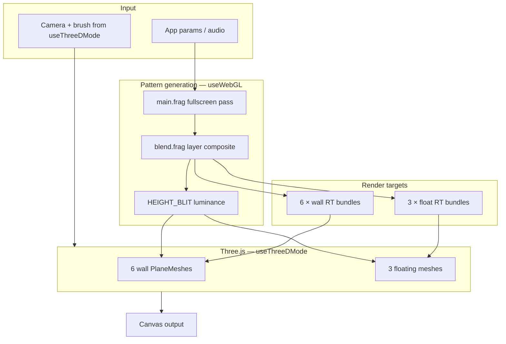
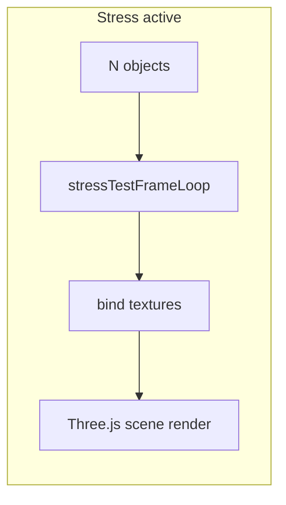

# Architecture Overview

## Dual-layer design

3D gallery mode splits responsibilities between two React hooks that share one ref:

```
┌─────────────────────────────────────────────────────────────────┐
│  App.jsx                                                         │
│  threeDEnabled, patternDisplacement*, params                     │
└───────────────────────────┬─────────────────────────────────────┘
                            │
┌───────────────────────────▼─────────────────────────────────────┐
│  WebGLCanvas.jsx                                                 │
│  threeDStateRef  ←──────────────→  shared mutable gallery API   │
│  threeDEnabledRef                                                │
└───────┬─────────────────────────────────────┬───────────────────┘
        │                                     │
        ▼                                     ▼
┌───────────────────┐               ┌───────────────────────────┐
│  useThreeDMode    │               │  useWebGL                 │
│  Three.js scene   │               │  Single WebGLRenderer     │
│  Camera + input   │               │  main.frag → RTs          │
│  Mesh lifecycle   │               │  Bind RTs → meshes        │
│  Displacement API │               │  render(scene, camera)    │
└───────────────────┘               └───────────────────────────┘
```

**Important:** There is only **one** WebGL context. The 2D pattern shader (`main.frag`) renders into offscreen RTs; Three.js draws those textures onto geometry in the same renderer.

## Per-frame data flow



## File map

| Path | Role |
|------|------|
| `src/App.jsx` | Root state: `threeDEnabled`, displacement params, keyboard **M** toggle |
| `src/components/WebGLCanvas.jsx` | Creates `threeDStateRef`, runs both hooks, pointer-lock brush |
| `src/components/Controls.jsx` | UI: 3D toggle, pattern heightmap checkbox, displacement slider, randomize |
| `src/hooks/useThreeDMode.js` | Gallery scene lifecycle, FPS camera, floating defs |
| `src/hooks/useWebGL.js` | Main animate loop, gallery RT pipeline, texture bind |
| `src/lib/galleryMapping.js` | `GALLERY_ROOM` dimensions, `worldHitToGallerySurface()` |
| `src/lib/galleryRoomMeshes.js` | Six `PlaneGeometry` walls with `lookAt(0,0,0)` |
| `src/lib/galleryStack.js` | Six independent wall stacks, face RT factory, transitions |
| `src/lib/galleryFloatingObjects.js` | Three object stacks, `renderFloatingObjectTexture()` |
| `src/lib/galleryDisplacement.js` | Materials, shape GLSL, height blit, bind helpers |
| `src/lib/galleryEdgeNeighbors.js` | Edge neighbor integrated time / distortion helpers for wall RT passes |
| `src/lib/textureRandomize.js` | Randomize profiles: `wall`, `shape`, `gallery` |
| `src/lib/randomizer.js` | `randomizeGalleryWallStacks()` public API |
| `src/shaders/main.frag` | Pattern generation; gallery face uniforms |
| `src/shaders/blend.frag` | Ping-pong layer blend |
| `src/shaders/main.vert` | Fullscreen quad for RT passes |
| `src/constants/index.js` | `patternDisplacementEnabled`, `patternDisplacement` defaults |
| `src/constants/sliderConfig.js` | `THREE_D_PARAM_KEYS` |
| `src/lib/stressTest.js` | Stress modes, RT factory, per-object pattern/color |
| `src/lib/stressTestParticles.js` | Particle sprites, layout, motion |
| `src/lib/stressTestCastle.js` | Procedural castle generator |
| `src/lib/stressBenchmark.js` | Offline GPU estimates + CPU timings |
| `src/hooks/useStressTestMode.js` | Stress Three.js scene lifecycle |

## Gallery readiness gate

In `useWebGL.js`, gallery rendering only runs when **all** of these are true:

```javascript
galleryReady =
  threeDEnabledRef.current &&
  tdGallery?.isGallery &&
  tdGallery.enabled &&
  tdGallery.scene &&
  tdGallery.wallMeshes &&
  tdGallery.camera &&
  galleryFacesRT.current &&
  galleryFloatingRT.current;
```

When `galleryReady` is false, the hook uses the standard 2D fullscreen feedback + blend path **unless stress test is active** (`stressReady` in `useWebGL.js`).

## Face index convention

All gallery code uses **Three.js BoxGeometry material order**:

| Index | Face | Normal direction |
|-------|------|------------------|
| 0 | +X | Right wall |
| 1 | −X | Left wall |
| 2 | +Y | Ceiling |
| 3 | −Y | Floor |
| 4 | +Z | Front wall |
| 5 | −Z | Back wall |

Wall meshes store `mesh.userData.faceIndex`. Floating object passes use `u_galleryFaceIndex = -1` (flat 2D UV, not wall projection).

## Incremental rendering (performance)

To spread GPU cost, not every surface is updated every frame:

- **Walls:** 2 faces per frame (`GALLERY_FACES_PER_FRAME`), plus the brush-hit face if painting
- **Floats:** 1 object per frame (`FLOATING_OBJECTS_PER_FRAME`)
- **Warmup / transition:** all 6 walls + all 3 floats in one batch

Non-updated surfaces keep their last `latestTexture` until the round-robin cursor reaches them again (~3 frames for walls).

## 2D vs 3D vs stress pattern stacks

The main canvas, gallery walls, floating objects, and stress tiles each use **separate** layer stack state (see [stress-test-system.md](./stress-test-system.md) for stress modes). Gallery incremental refresh does **not** apply during stress runs.

## Legacy code paths

`useWebGL.js` still contains a **sphere mouse-mapping** branch (`td.mesh`, `mouseOnSphere`) for an older non-gallery 3D mode. Current `useThreeDMode` always sets `isGallery: true`, so that path is inactive unless another hook fills `threeDStateRef` differently.

`main.frag` may contain unused atlas helpers (`galleryAtlasToFace`) with a different face convention — treat as dead code until removed.

## Stress test mode (summary)

When `stressTestMode !== 'off'`, gallery 3D is disabled and `useWebGL` runs **`runStressTestFrameLoop`** instead of the gallery or 2D paths. Every active object receives a full pattern RT update each frame (no round-robin).

| Branch | Scene hook | Display module |
|--------|------------|----------------|
| `plane2d` | `useStressTestMode` | `stressTestScene.js` — ortho tile grid |
| `cubes3d` | + fly controls | `stressTestScene.js` — textured box grid |
| `particles3d` | + fly controls | `stressTestParticles.js` — sprite billboards + motion |
| `castle*` | + fly controls | `stressTestCastle.js` → `stressTestScene.js` |

Shared infrastructure: `stressTest.js` (RT pool, per-tile modes), `stressTestFrameLoop.js` (N× main.frag + blend), `flyControls.js` (3D navigation).

Full detail, performance notes, and benchmark commands: **[stress-test-system.md](./stress-test-system.md)**.



## Render path selection

```
stressTestMode !== 'off'  →  stressTestFrameLoop + stress scene
else threeDEnabled        →  galleryFrameLoop + gallery scene
else                      →  canvas2D feedback + display quad
```

See `useWebGL.js` `stressReady` / `galleryReady` gates.
