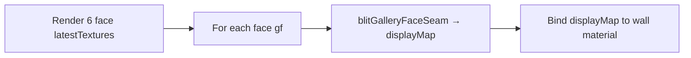

# Gallery Seams

## Goal

When six walls each render an **independent** pattern texture, edges and corners show visible discontinuities. The seam system was designed to:

1. Blend **animation time** and **distortion** near face edges during RT generation (`main.frag`)
2. Post-process **color** in edge bands by sampling neighbor face textures (`blitGalleryFaceSeam`)

## Current status: partially implemented

| Component | Status |
|-----------|--------|
| `GALLERY_FACE_EDGE_NEIGHBORS` | Implemented |
| `getGalleryEdgeNeighborTimes/Distortion` | Implemented, fed to shader during RT pass |
| `u_galleryEdgeBlend` in `main.frag` | **Always set to 0** during RT generation |
| `displayMap` RT per face | Allocated + cleared, **never written** |
| `blitGalleryFaceSeam()` | Implemented, **never called** from `useWebGL.js` |
| `bindGallerySeamTextures()` | Implemented, **not used** on wall materials |
| Wall flat materials | `MeshBasicMaterial` — no seam samplers |

**Net effect today:** walls behave as six independent textures. Neighbor uniform data is computed but edge blend in `main.frag` is disabled. No post seam composite runs.

## Edge neighbor table

`GALLERY_FACE_EDGE_NEIGHBORS[face]` → `[uMin, uMax, vMin, vMax]` neighbor face indices.

BoxGeometry order: +x, -x, +y, -y, +z, -z.

Example: face 0 (+x) neighbors along uMin/uMax/vMin/vMax edges are faces `[4, 5, 3, 2]`.

## Coordinate helpers

`galleryFaceUVToWorld(face, u, v)` and `galleryWorldToFaceUV(face, p)` — convert between face UV and world position on room box. Must stay consistent with `worldHitToGallerySurface()` in `galleryMapping.js`.

## Edge blend width

```javascript
export const GALLERY_EDGE_BLEND = 0.1; // in face UV space (0–1)
```

Used in seam GLSL and intended for `u_galleryEdgeBlend` during pattern generation.

## Intended wiring (not yet done)



Pseudo-sequence in `useWebGL` animate:

```javascript
// After all faces updated this frame:
for (let gf = 0; gf < 6; gf++) {
  blitGalleryFaceSeam(renderer, seamPass, {
    selfTexture: faces[gf].latestTexture,
    neighborTextures: faces.map(f => f.latestTexture),
    faceIndex: gf,
    outputTarget: faces[gf].displayMap,
  });
}

// Bind displayMap.texture instead of latestTexture
bindFacePatternTextures(..., { displayTexture: face.displayMap.texture });
```

## In-shader edge animation sync

When `u_galleryEdgeBlend > 0`, `main.frag` can blend integrated time and distortion toward neighbor face values in edge bands. This keeps **motion** continuous even before color seam blit.

**Caution:** enabling both in-shader edge blend AND post blit may double-blend — test one at a time.

## Displacement and seams

Seam blit GLSL comments mention blending displacement-relevant data. If seams are enabled, height maps may also need edge consistency — either seam the color before height blit or blit height maps separately with the same edge logic.

## Files

- `src/lib/gallerySeams.js` — full implementation
- `src/lib/galleryDisplacement.js` — re-exports `createGallerySeamBlitPass`, `blitGalleryFaceSeam`
- `src/hooks/useWebGL.js` — neighbor uniforms set; `u_galleryEdgeBlend = 0`; no blit call
- `src/shaders/main.frag` — gallery edge blend branch (inactive while blend = 0)

## Enabling seams — checklist

1. After face RT batch, call `blitGalleryFaceSeam` for each face into `displayMap`
2. Bind `displayMap.texture` to wall materials (flat + displaced `u_display`)
3. Optionally set `u_galleryEdgeBlend = GALLERY_EDGE_BLEND` during RT generation for time sync
4. Verify no double blending
5. Test corners (+x/+y/+z triple meeting)
6. Test with displacement on — check rim height continuity

## Dead code warning

`main.frag` may contain alternate atlas helpers (`galleryAtlasToFace`) with a **different** face indexing scheme. Do not mix with `gallerySeams.js` / `galleryMapping.js` convention without reconciling.
