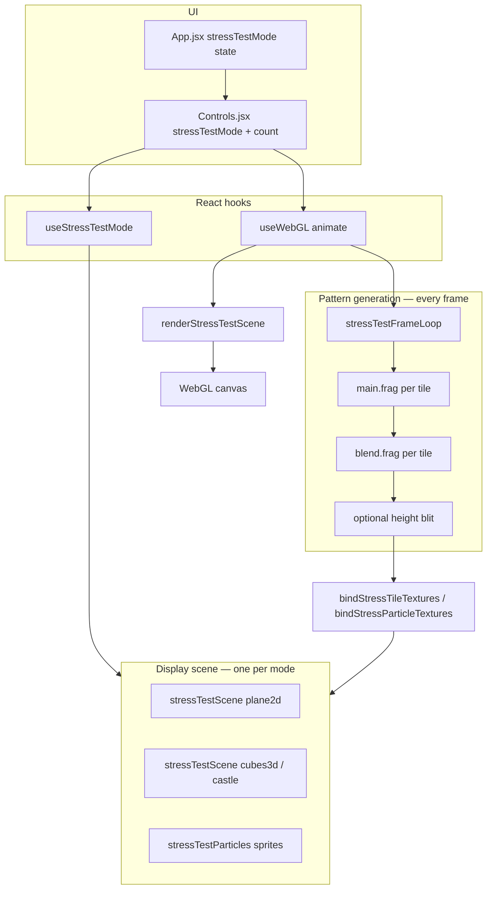

# Stress Test System

Stress-test modes benchmark how many **independent pattern pipelines** Mezmer can sustain. Each visible object (tile, cube, castle brick, particle sprite) runs its own mini copy of the 2D engine: `main.frag` feedback → `blend.frag` → optional height blit → texture bound to Three.js geometry.

Stress test and **3D Gallery Room** are **mutually exclusive** (`stressTestMode !== 'off'` disables gallery 3D).

## Modes

| Mode | UI label | Object count | Display | Navigation |
|------|----------|--------------|---------|------------|
| `off` | Off | — | Main 2D canvas or gallery | — |
| `plane2d` | 2D Tile Plane | 1–64 (slider) | Ortho grid of textured planes | — |
| `cubes3d` | 3D Cube Grid | 1–32 (slider) | Textured box grid | Noclip fly |
| `particles3d` | 3D Particles | 1–256 (slider) | Textured sprite billboards + orbital motion | Noclip fly |
| `castle100` | 3D Castle (100) | fixed 100 | Procedural castle meshes | Noclip fly |
| `castle1000` | 3D Castle (1,000) | fixed 1,000 | Same layout, scaled RTs | Noclip fly |
| `castle10000` | 3D Castle (10,000) | fixed 10,000 | Stress ceiling | Noclip fly |

### Performance budgeting (< 1,000 objects)

For day-to-day gallery tuning, treat **~1,000 patterned surfaces** as a soft ceiling on mid-range GPUs. Beyond that, frame time is dominated by **N × (feedback + blend)** shader passes, not Three.js draw calls.

Early observations:

- **Castle / cubes / 2D tiles** scale linearly with object count and tile RT size.
- **Particles** add cheap `THREE.Sprite` billboards; internal pattern RT cost is the same order as a cube face at the same count. Sprite motion (`updateStressParticleMotion`) is negligible CPU/GPU compared to pattern generation.
- At high counts, adaptive **tile RT size** shrinks (64 → 48 → 32 px) to cap memory and fill rate.

Use `npm run benchmark:stress` for estimated pass counts and RT memory; use the in-app **FPS overlay** for ground-truth frame times.

## Architecture



## Per-frame order (`useWebGL.js`)

When `stressTestMode !== 'off'` and the Three.js stress scene is ready:

1. **`runStressTestFrameLoop`** — for each active object:
   - Pick per-object visual mode, color mode, and layer patterns (`applyStressTileModes`, `applyStressTileLayerUniforms`)
   - Integrate per-tile time state
   - Feedback pass → blend pass → optional height blit
   - **Particles:** `updateStressParticleMotion` runs here (same `deltaSec` / `timeScale` as patterns)
2. **Bind textures** to meshes or sprites
3. **Relayout** only when object count changes (not every resize)
4. **`renderStressTestScene`** — update fly camera, `renderer.render(stressScene, camera)`

Gallery warm-up flags are forced off during stress runs so incremental gallery logic never runs.

## Per-object variation

Each tile index gets deterministic diversity via `stressTest.js`:

| `partType` | Used in | Pattern bias |
|------------|---------|--------------|
| `brick` | Castle walls | wovenGrid, hyperTuring, reactionDiff, … |
| `tile` | Castle floor | kaleidoWave, crystal, stainedGlass, … |
| `shingle` | Castle roof | plasma, aurora, spiralArms, … |
| `particle` | Particle mode | plasma, aurora, inkDrop, smoothSpiral, … |
| `null` | plane2d / cubes3d | generic rotation |

Each object also gets its own **visual post mode** (`normal`, `glow`, `crt`, …) and **global color mode** with `u_forceGlobalColor = true`, independent of the main canvas settings.

## Particle system (`particles3d`)

File: `src/lib/stressTestParticles.js`

- **Pool:** up to `STRESS_TEST_MAX_PARTICLES` (256) sprites pre-allocated; slider activates N of them.
- **Layout:** golden-angle distribution in a 3D volume; scale shrinks slightly as count rises.
- **Motion:** orbital + drift offsets from anchor; driven by `simTime` in `updateStressParticleMotion`.
- **Textures:** one full pattern RT per visible sprite (`bindStressParticleTextures`).
- **Important:** layout sets anchors/params only — **not** world positions every frame. Motion runs in the frame loop so pattern animation and sprite movement stay in sync.

RT size tiers (particles): 64 px default, 48 px at ≥64 objects, 32 px at ≥128.

## Castle generator

File: `src/lib/stressTestCastle.js`

- Procedural castle: floor tiles, wall bricks, roof shingles, corner towers, parapet, stepped keep roof.
- Uniform grid pitch `P = 0.44`; slot occupancy prevents duplicates.
- `generateCastleParts(count)` returns `{ type, position, scale, rotation }[]` consumed by `layoutCastleScene`.
- Count presets: 100 / 1,000 / 10,000 map to fixed modes; mesh pool sized to `STRESS_TEST_MAX_OBJECTS` (10k).

## Render target bundle (per object)

Same structure as documented in [texture-pipeline.md](./texture-pipeline.md), but N copies:

```javascript
{
  w, h,           // getStressTileRenderSize(...)
  fbA, fbB,       // feedback ping-pong
  outA, outB,     // blend output ping-pong
  heightMap,      // luminance for displacement
  latestTexture,
}
```

`ensureStressTileTargetPool` grows/shrinks the pool when count or canvas size changes.

## Heightmap / displacement

When **Pattern Heightmap** is enabled (Controls), stress modes use displaceable materials (subdivided planes/boxes) and height blit per tile — same as gallery walls. Particles use flat sprites (no vertex displacement).

## Navigation

3D stress modes (`cubes3d`, castle*, `particles3d`) share noclip fly from `src/lib/flyControls.js`:

- Click canvas → pointer lock
- WASD move, Space/E up, Q/Ctrl down, Shift sprint, Esc unlock

Wired in `useStressTestMode.js` via `attachStressFlyControls`.

## Controls wiring

| Control | Param / state | Notes |
|---------|---------------|-------|
| Stress Test dropdown | `App.stressTestMode` | Mutual exclusive with gallery 3D |
| Stress Test Count | `params.stressTestCount` | Hidden for fixed-count castle modes |
| Pattern Heightmap | `params.patternDisplacementEnabled` | Stress + gallery 3D |
| Pattern Displacement | `params.patternDisplacement` | Stress + gallery 3D |
| FPS overlay | `showFpsCounter` | Best for live tuning |

`stressTestCount` is excluded from randomize (same as gallery room lockouts).

## Key source files

```
src/lib/stressTest.js              — modes, RT pool, per-tile uniforms/modes
src/lib/stressTestScene.js         — 2D plane / 3D cube / castle scenes
src/lib/stressTestCastle.js        — procedural castle parts
src/lib/stressTestParticles.js     — particle sprites + motion
src/lib/webgl/stressTestFrameLoop.js — N× pattern render loop
src/hooks/useStressTestMode.js     — scene lifecycle + fly controls
src/hooks/useWebGL.js              — branch: stress vs gallery vs 2D
src/lib/stressBenchmark.js         — offline cost estimates + CPU timings
scripts/benchmark-stress.js        — CLI: vitest + benchmark report
```

## Benchmarking & tracking

```bash
npm run benchmark:stress
npm run benchmark:stress:full          # includes castle10k estimates
npm run benchmark:stress -- --displacement
npm run benchmark:stress -- --json benchmarks/2026-05-19.json
```

The script:

1. Runs **`npm test`** (must pass)
2. Prints a **GPU estimate table** (shader passes, megapixels/frame, RT memory, relative cost)
3. Prints **CPU layout timings** (castle generation, particle/cube/plane layout)
4. Writes **`benchmarks/stress-latest.json`** for diffing over time

**In-app FPS** remains the authoritative metric for GPU frame time. Use JSON snapshots to track regressions when changing RT sizes, shader cost, or object caps.

See [benchmarks/README.md](../benchmarks/README.md) for archiving runs.

## Related docs

- [texture-pipeline.md](./texture-pipeline.md) — RT layout shared with gallery
- [displacement-system.md](./displacement-system.md) — height blit + displaceable materials
- [architecture-overview.md](./architecture-overview.md) — gallery vs stress vs 2D paths
- [3d-mode-lifecycle.md](./3d-mode-lifecycle.md) — gallery hook lifecycle (contrast with stress)
