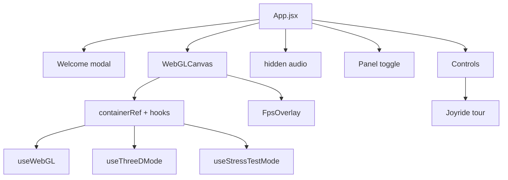

# UI Architecture and Layout

## Component tree

```
main.jsx (StrictMode)
└── App.jsx
    ├── [conditional] Welcome modal (inline JSX, not a separate component)
    ├── WebGLCanvas.jsx
    │   ├── div ref={containerRef}     ← WebGL canvas injected here by useWebGL
    │   └── FpsOverlay.jsx (conditional)
    ├── <audio ref={audioElementRef}> (hidden)
    ├── Toggle button ☰ / ✖ (top-left)
    └── [conditional] Controls.jsx
        ├── react-joyride <Joyride> (when runTutorial)
        └── #controls-container
            ├── fieldset #fieldset-audio
            ├── fieldset #fieldset-randomization
            ├── fieldset #fieldset-layer
            └── fieldset #fieldset-global
```



There is **no `Scene3DOverlay` component**. 3D gallery and stress-test scenes are mounted imperatively inside `WebGLCanvas` via hooks, not as React overlay components.

## Layout regions (viewport)

```
┌─────────────────────────────────────────────────────────────┐
│ ☰/✖ (z:1000)                              [Controls z:10]   │
│                                              320px panel    │
│                                                             │
│              WebGLCanvas (full viewport)                    │
│              z-index 0                                      │
│                                    [FPS overlay z:20]       │
│                                                             │
│ [Welcome modal z:2000 when first visit]                     │
└─────────────────────────────────────────────────────────────┘
```

| Region | CSS / positioning | z-index |
|--------|-------------------|---------|
| App container | `APP_STYLES.appContainer` — 100vw×100vh, black, overflow hidden | — |
| Canvas container | `CANVAS_STYLES.canvasContainer` — absolute fill | 0 |
| Canvas element | `width/height: 100%` via `index.css` | inside container |
| Controls wrapper | `CONTROL_STYLES.controlsWrapper` — top-right, 320px | 10 |
| FPS overlay | Inline styles — top-right, pointer-events none | 20 |
| Panel toggle | `APP_STYLES.toggleButton` — top-left | 1000 |
| Welcome modal | `APP_STYLES.welcomeModalOverlay` | 2000 |

`index.html`: `#root` is 100vw×100vh; body has no margin.

## Component reference

### `App.jsx`

**Role:** Root orchestrator — owns UI visibility, mode flags (3D, stress, FPS), wires hooks, passes props.

**Owns locally:**

| State | Purpose |
|-------|---------|
| `controlsVisible` | Show/hide panel |
| `blendSpeedFactor` | Transition speed multiplier (not always in `params`) |
| `threeDEnabled` | 3D gallery |
| `stressTestMode` | `'off' \| 'plane2d' \| 'cubes3d'` |
| `showFpsCounter`, `vsyncEnabled`, `fps` | Performance overlay |
| `captureStream` | Electron desktop audio stream |
| `showWelcomeModal`, `runTutorial` | First-run UX |
| `isRandomizingRef`, `audioTextureRef` | Shared refs |

**Delegates to hooks:** `useAppParams`, `useAudio`, `useRandomization`, `usePresetShare`, `useDesktopCapture`, `useKeyboardShortcuts`.

**Mutual exclusion:** Enabling 3D sets stress test to `'off'`. Enabling stress test disables 3D.

**Note:** App uses `jsx`/`jsxs` from `react/jsx-runtime` (extracted/decompiled style), not typical `return (<...>)` syntax.

---

### `WebGLCanvas.jsx`

**Role:** Full-viewport rendering host; pointer/wheel handlers; mounts three hooks.

**Local refs only** — no React state.

**Hooks inside:**

| Hook | When active |
|------|-------------|
| `useWebGL` | Always — main shader + rAF |
| `useThreeDMode` | `threeDEnabled && stressTestMode === 'off'` |
| `useStressTestMode` | `stressTestMode !== 'off'` |

**Pointer behavior:**

- **LMB hold:** `threeDStateRef.brushActive` (pointer lock requested in 3D gallery)
- **RMB:** `onCanvasPointerDown` → mouse FX randomize animation
- **Wheel:** `onMouseWheel` → `mouseRadius`

**Children:** `FpsOverlay` when `showFpsCounter`.

**Props not passed from App:** `visualModes`, `animationProgress`, `visualModeTransition`, `onCanvasReady` — accepted but unwired.

---

### `Controls.jsx`

**Role:** Scrollable right panel — audio, randomization, layer editor, globals, Joyride.

**Export:** `memo(Controls)` (~790 lines, single file).

**Local state:** Collapsible sections `{ audio, randomization, layer, global }` (all default expanded). Not persisted.

**Internal helpers:**

- `he(paramKey, value)` — builds slider from `SLIDER_CONFIG`
- `Z(event)` — unified change handler → `onParamChange` or dedicated setters

**Dead prop:** `patternParameterMap` is passed from App but **never used** in Controls (mapping via `getRelevantParamsForPattern` only).

---

### `FpsOverlay.jsx`

**Role:** Top-right FPS readout.

**Props:** `fps`, `visible`.

**Styling:** Inline styles only — not in CSS module map.

---

### `components/index.js`

Barrel: exports `Controls`, `WebGLCanvas`, `FpsOverlay`.

## Render modes (UI perspective)

The user picks **one primary render path** via checkboxes/selects:

| UI control | Render path |
|------------|-------------|
| 3D Gallery Room ✓, Stress Test = off | Gallery room (`useThreeDMode` + gallery RT loop) |
| Stress Test = plane2d / cubes3d | Stress benchmark (`useStressTestMode`) |
| Both off | Standard 2D fullscreen shader |

3D and stress test are mutually exclusive in App state.

## External UI dependencies

| Package | Usage |
|---------|--------|
| `react` / `react-dom` ^18 | UI runtime |
| `react-joyride` ^2.9 | Guided tour inside Controls |
| `three` | Via hooks (not React Three Fiber) |
| `electron` (dev) | Desktop capture UI gated by `isElectron` |

## Collapsible fieldsets

Each major section has a legend click toggler (local React state). Tour steps target fieldset ids but do **not** auto-expand collapsed sections.
