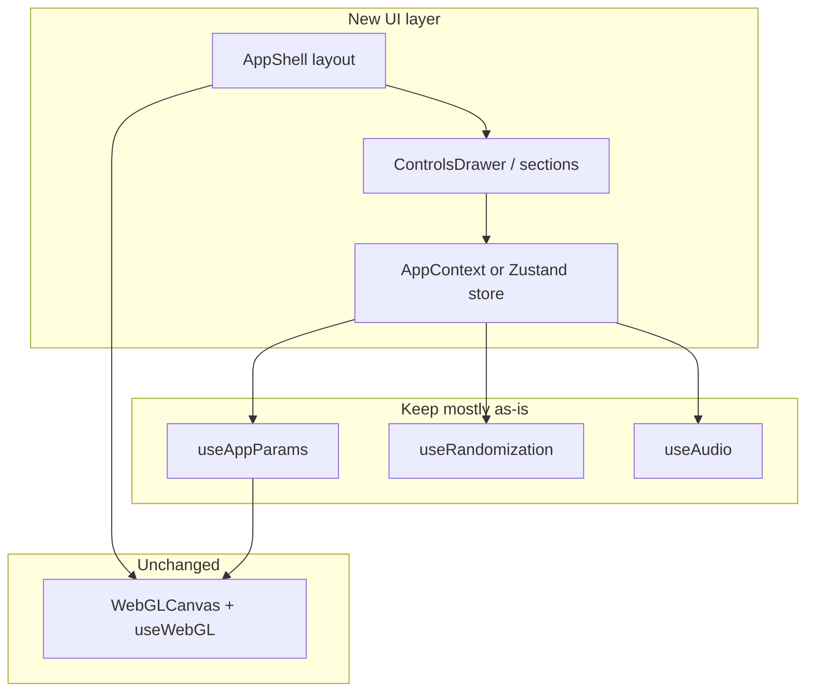

# UI Rework Brief

Executive summary for designers/developers/agents planning a Mezmer UI overhaul.

## Current state (one paragraph)

Mezmer's UI is a **single fullscreen WebGL canvas** with an optional **320px right panel** (`Controls.jsx`, ~790 lines) and a **top-left panel toggle**. All application state lives in **`App.jsx` + six custom hooks** with **~55 props drilled** into Controls. There is no Context, no component library, and styles are **hashed CSS extracted from a legacy bundle**. Three render modes (2D, 3D gallery, stress test) share one canvas via mutually exclusive hooks.

---

## Goals a rework might target

- Split Controls into section components (Audio, Randomize, Layer, Global)
- Replace prop drilling with Context or a small store
- Modern design system (spacing, typography, dark theme polish)
- Responsive / collapsible panel (drawer, bottom sheet on mobile)
- Accessible labels, keyboard nav, fixed Joyride targets
- Human-readable component code (rename minified Controls internals)
- Consolidate strings and tooltips

---

## Must preserve (breaking these breaks the app)

### 1. Params contract

- Single `params` object + **`paramsRef`** synced every frame for WebGL
- Four layers `layer1`–`layer4` with `patternType`, blend fields, pattern-specific keys
- **`visualMode`, `globalColorMode`, `forceGlobalColor`** outside `params` but preset/randomize aligned

### 2. Transition state

- `manualBlendProgress` — auto-randomize pauses while non-null
- Layer pattern/symmetry blend RAFs in `useAppParams`
- Visual mode blend RAF
- `blendSpeedFactor` scales all transition durations

### 3. Randomize contract

- Button → `handleRandomize` (not RMB — RMB is mouse FX only)
- Also calls `randomizeGalleryWallStacks()` (module state, not React)
- `isRandomizingRef` + `isRandomizing` block param edits during transition

### 4. Presets v2

- Encode/decode: params + visualMode + color globals + 6 wall stacks + 3 float stacks
- URL `#seed=` auto-load on mount

### 5. Mode mutex

- `threeDEnabled` ↔ `stressTestMode !== 'off'` exclusive
- Gallery 3D only when `threeDEnabled && stressTestMode === 'off'`

### 6. Audio pipeline

- `audioTextureRef` written by analyse loop — do not drop ref wiring
- `captureStream` lifecycle (stop tracks on unmount)
- `resetAudioReactiveColorModes` when playback/capture starts

### 7. Pointer / canvas

- LMB brush → `threeDStateRef.brushActive`
- 3D pointer lock on LMB
- Wheel → `mouseRadius`
- RMB → mouse FX animation keys

### 8. Keyboard

- 1–4 layers, H panel, F fullscreen, M 3D (global, skip form fields)
- 3D movement keys in `useThreeDMode` (separate from shortcuts hook)

### 9. Stable DOM ids (if keeping Joyride/tests)

See [controls-catalog.md](./controls-catalog.md). Any id rename requires updating `JOYRIDE_STEPS`.

---

## Known pain points (safe to fix in rework)

| Pain | Severity | Notes |
|------|----------|-------|
| 55+ props into Controls | High | Primary driver for Context/store |
| Monolithic Controls.jsx | High | Split by fieldset |
| Minified prop/helper names in Controls | Medium | Readability |
| Dead `patternParameterMap` prop | Low | Remove from App→Controls |
| Duplicate source select handlers | Low | `onSourceSelected` / `onSourceSelect` / `setSelectedSourceId` |
| Hash-only CSS, no source modules | High | Blocks theming |
| Joyride `#slider-n` mismatch | Medium | Tour broken for symmetry step |
| `layer2Freq` vs `freq` bug | Medium | Woven grid slider missing |
| Missing sliders for rd*, rainbowAnimationSpeed | Medium | Feature gaps |
| `pixelationFactor` default 100 vs slider max 10 | Low | Clamped on mode switch |
| Material ready callbacks are stubs | Low | Wire for export later |
| FPS state round-trip App→Canvas→App | Low | Could use ref only |
| Collapsible sections not persisted | Low | UX polish |
| Footer shortcut text can drift from code | Low | Keep in sync |

---

## Suggested rework architecture

**Recommended phases:**

1. **Document & test** — use [user-actions-wiring.md](./user-actions-wiring.md) as manual QA script
2. **Extract section components** — same props interface initially
3. **Introduce context** — move App state behind `MezmerProvider`; Controls consumes hooks
4. **Restyle** — new CSS/Tokens; preserve element ids or update Joyride
5. **Fix catalog gaps** — freq/layer2Freq, rd sliders, Joyride targets
6. **Optional** — persist panel layout, mobile drawer

---

## What NOT to do in a pure UI rework

- Do not change `params` key names without updating shaders, presets, `PARAM_CONFIG`, `SLIDER_CONFIG`
- Do not merge gallery wall stacks into React state without updating preset/randomize paths
- Do not remove `paramsRef` — frame loop depends on it
- Do not bind Space to randomize (intentionally removed; Space = 3D up)

---

## Files to touch in a typical UI rework

| Priority | Files |
|----------|-------|
| High | `Controls.jsx`, `App.jsx`, `controlStyles.js`, `index.css` |
| Medium | `joyrideSteps.js`, `WebGLCanvas.jsx` (layout only), `FpsOverlay.jsx` |
| Low | `sliderConfig.js` (labels), `Controls` section extractions |
| Avoid first pass | `useWebGL.js`, shaders, gallery libs |

---

## Regression test checklist (post-rework)

- [ ] All four layers editable; pattern change animates blend
- [ ] Randomize All + auto-randomize (bpm + time modes)
- [ ] Preset copy/load/URL including gallery appearance in 3D
- [ ] Audio file + Electron capture (if applicable)
- [ ] 2D brush LMB, RMB FX, wheel radius
- [ ] 3D toggle, WASD, pointer lock, displacement checkbox
- [ ] Stress test modes mutually exclusive with 3D
- [ ] Keyboard 1–4, H, F, M
- [ ] Joyride completes without missing targets
- [ ] Fullscreen canvas sizing on window resize
- [ ] Controls hidden state — canvas still fills viewport

---

## Related documentation

- [../README.md](../README.md) — 3D gallery (rendering, not panel UI)
- [architecture-and-layout.md](./architecture-and-layout.md)
- [state-and-data-flow.md](./state-and-data-flow.md)
- [controls-catalog.md](./controls-catalog.md)

---

## Investigation metadata

- **Method:** Four parallel read-only codebase explorations (components, App wiring, controls config, canvas hooks)
- **Code changes:** None
- **Branch context:** Written on `3d` branch; App uses extracted hooks (`useAppParams`, etc.)
