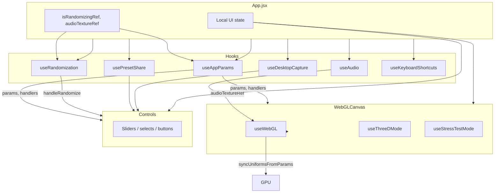

# State and Data Flow

## Architecture diagram

## Hook responsibilities

### `useAppParams({ isRandomizingRef, blendSpeedFactor })`

**Single source of truth for shader configuration** (mostly).

| Export | Purpose |
|--------|---------|
| `params` / `setParams` / `paramsRef` | Flat object: globals + `layer1`–`layer4` |
| `activeLayer` / `setActiveLayer` | Which layer panel edits |
| `visualMode` / `setVisualMode` | `'normal'`, `'pixelate'`, `'ascii'`, etc. |
| `globalColorMode`, `forceGlobalColor` | Color globals (**outside** `params`) |
| `manualBlendProgress` | Layer pattern/symmetry transition state |
| `patternNameToIndex` | Pattern string → shader index |
| `getRelevantParamsForPattern` | Which sliders show per pattern |
| `handleParamChange` | All panel slider/select/checkbox routing |
| `handleMouseWheel` | `mouseRadius` adjustment |
| `handleCanvasPointerDown` | RMB mouse FX animation |
| `applyPresetToState` | Bulk merge from preset decode |
| `resetAudioReactiveColorModes` | Swap audio colors when audio starts |

**Transition RAFs (internal):** layer pattern blend, symmetry blend, visual mode blend, mouse param randomize.

**Guard:** `handleParamChange` no-ops during randomize (except `visualMode`) via `isRandomizingRef`.

---

### `useRandomization({ paramsRef, setParams, ... })`

| Export | Purpose |
|--------|---------|
| `isRandomizing` | Blocks UI edits |
| `handleRandomize(forceGlobals?)` | Full randomize + gallery stacks |
| `randomizeGlobals/ColorModes/VisualMode` | Checkbox state |
| `activeTheme` | `chaotic` / `geometric` / `organic` |
| Auto-randomize suite | Enable, mode (`bpm`\|`time`), intervals |

**Side effects:** RAF lerp over ~2.5s/blendSpeed; calls `randomizeGalleryWallStacks()`; auto-randomize 100ms timer loop.

---

### `usePresetShare({ params, visualMode, ... applyPresetToState })`

| Export | Purpose |
|--------|---------|
| `presetCode` / `setPresetCode` | Text field |
| `handleCopyPreset` | Encode + clipboard |
| `handleLoadPreset` | Decode from field |
| `handleLoadFromUrl` | Parse `#seed=` hash |

Mount effect: auto-load URL seed on startup.

---

### `useAudio(audioTextureRef, fftSize, captureStream)`

| Export | Purpose |
|--------|---------|
| `audioData` | `{ frequencyData, beatStrength, spectralCentroid }` |
| `loadAudio`, `togglePlay`, `isPlaying` | File playback |
| `estimatedBpm`, `isBassPresent`, `isDrumsPresent` | Auto-randomize + uniforms |
| `audioElementRef` | Hidden `<audio>` in App |
| `drumOnsetDetected` | Ref (init-only uniform caveat) |

Writes FFT to `audioTextureRef` DataTexture directly each analyse frame.

---

### `useDesktopCapture({ audioElementRef, ... })`

Electron-only desktop audio capture → `captureStream` → `useAudio`.

---

### `useKeyboardShortcuts({ onLayerSelect, onToggleControls, onToggleThreeD })`

Global `keydown` on `window`. Ignores INPUT/SELECT/TEXTAREA.

| Key | Action |
|-----|--------|
| `1`–`4` | Select layer |
| `H` | Toggle controls panel |
| `F` | Fullscreen |
| `M` | Toggle 3D |

**Note:** Space is **not** bound to randomize (removed). Space in 3D gallery = move up (`useThreeDMode`).

---

## Params schema

`params` structure:

### Top-level globals

| Key group | Examples |
|-----------|----------|
| Blend / time | `feedbackMix`, `globalTimeScale`, `globalDistortionScale`, `uvScale`, `globalAudioSensitivity`, `globalSymmetryOffsetSpeed`, `rainbowAnimationSpeed` |
| Visual post | `pixelationFactor`, `asciiCharSize` |
| Mouse FX | `mouseRadius`, `mouseDistortion`, `mouseSymmetry`, `mouseAttract`, `mouseTwist` |
| 3D | `patternDisplacementEnabled`, `patternDisplacement` |
| Stress | `stressTestCount` |
| Runtime (in params) | `visualModeFromIndex`, `visualModeToIndex`, `visualModeBlend` |

### Per-layer (`layer1` … `layer4`)

Each layer: `{ patternType, colorMode, blendAmount, blendTargetType, symmetry, distortion, freq, ...pattern-specific keys }`.

Defaults in `DEFAULT_LAYERS` (`constants/index.js`). Layer 4 often starts as `invisible`.

### Outside `params` (must stay in sync)

| Field | Why separate |
|-------|--------------|
| `visualMode` | String name; presets encode separately |
| `globalColorMode` | Same |
| `forceGlobalColor` | Same |
| `blendSpeedFactor` | App state; also listed in `GLOBAL_PARAM_KEYS` |

### Key constant groupings (`sliderConfig.js`)

- `GLOBAL_PARAM_KEYS` — global sliders
- `MOUSE_PARAM_KEYS` — mouse influence block
- `THREE_D_PARAM_KEYS` — `patternDisplacement`
- `MOUSE_RANDOM_PARAM_KEYS` — RMB randomize targets only

---

## App → WebGLCanvas props

| Prop | Source |
|------|--------|
| `params` | useAppParams |
| `audioData`, `estimatedBpm`, bass/drum flags | useAudio |
| `blendSpeedFactor` | App state |
| `visualMode`, `globalColorMode`, `forceGlobalColor` | useAppParams |
| `patternNameToIndex`, `isRandomizing` | hooks |
| `audioTextureRef` | App ref |
| `threeDEnabled`, `stressTestMode` | App state |
| `showFpsCounter`, `vsyncEnabled`, `fps`, `onFpsUpdate` | App state |
| `onMouseWheel`, `onCanvasPointerDown` | useAppParams handlers |
| Material ready callbacks | App stubs (no-op) |

---

## App → Controls props (~55)

Grouped for rework planning:

| Category | Props |
|----------|-------|
| Params | `params`, `activeLayer`, `onParamChange`, `paramConfigs`, `getRelevantParamsForPattern`, `patternParameterMap`† |
| Layer | `patternTypes`, `onLayerSelect`, `manualBlendProgress`, `isRandomizing` |
| Visual/color | `visualMode`, `visualModes`, `setVisualMode`, `globalColorMode`, `colorModes`, `forceGlobalColor`, setters |
| Randomize | `onRandomize`, theme, auto-randomize, checkbox flags |
| Presets | `presetCode`, copy/load/URL handlers |
| Audio/Electron | file, play, capture, sources, `isElectron` |
| Modes/perf | `threeDEnabled`, stress test, FPS, VSync, displacement |
| Tutorial | `runTutorial`, `handleJoyrideCallback` |
| Misc | `blendSpeedFactor`, duplicated pixelation/ascii |

† `patternParameterMap` unused in Controls.

---

## Param update paths

1. **Controls slider** → `handleParamChange` → `setParams` / transitions
2. **Randomize button** → `handleRandomize` → RAF → `setParams` + gallery module stacks
3. **Preset load** → `applyPresetToState` + gallery stack apply
4. **RMB canvas** → `handleCanvasPointerDown` → mouse keys only (~900ms lerp)
5. **Wheel** → `handleMouseWheel` → `mouseRadius`
6. **Every frame** → `useWebGL` reads `paramsRef.current` via `syncUniformsFromParams`

---

## Gallery / float stacks (not React state)

Wall and floating object pattern stacks live in **module-level state** (`galleryStack.js`, `galleryFloatingObjects.js`). Randomize and presets mutate these via:

- `randomizeGalleryWallStacks()`
- `applyGalleryStacksFromPreset()` (presets)

UI does not edit these directly except through randomize/preset actions.

---

## Side effects summary

| Location | Effect |
|----------|--------|
| useKeyboardShortcuts | window keydown |
| useRandomization | RAF + setTimeout auto-randomize |
| useAppParams | Multiple RAF transition loops |
| usePresetShare | URL hash load on mount |
| useAudio | Analyse rAF loop |
| App | captureStream cleanup; audio color reset effect |
| WebGLCanvas | pointer lock, wheel, context menu prevent |
| useWebGL | WebGL rAF, resize listener |
