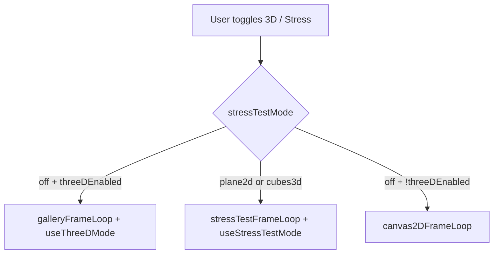

# User Actions → Code Path Wiring

Regression checklist for UI rework. Every user-facing action and the code it touches.

## Keyboard (global — `useKeyboardShortcuts.js`)

| Action | Condition | Code path | Effect |
|--------|-----------|-----------|--------|
| `1`–`4` | Not in form field | `handleLayerSelect` → `setActiveLayer` | Layer panel targets layerN |
| `H` | Not in form field | `toggleControls` | `controlsVisible` flip |
| `F` | Not in form field | `document.documentElement.requestFullscreen()` | Browser fullscreen |
| `M` | Not in form field | `toggleThreeD` | 3D on; stress off if enabling |

**3D only** (`useThreeDMode.js`, separate listener):

| Key | Effect |
|-----|--------|
| WASD / arrows | Horizontal move |
| Space / E | Move up |
| Q / Ctrl | Move down |
| Shift | 2× speed |
| Escape | Exit pointer lock, clear brush |

---

## Canvas / pointer (`WebGLCanvas.jsx` + `createWebGLContext`)

| Action | Code path | Effect |
|--------|-----------|--------|
| Mouse move (2D) | `onPointerMove` → `mouseUvRef` | `u_mouse` uniform |
| Mouse move (3D locked) | `useThreeDMode` pointer lock | Camera look |
| LMB down | `brushActive=true`, optional `requestPointerLock` | Brush paint |
| LMB up | `brushActive=false` | Stop paint |
| RMB down | `onCanvasPointerDown` → `handleCanvasPointerDown` | Animate mouseDistortion/Symmetry/Attract/Twist |
| Wheel | `onMouseWheel` → `handleMouseWheel` | `params.mouseRadius` |
| Context menu | `preventDefault` | Blocked on canvas |

Gallery brush: center-screen raycast in sync loop → `u_mouseGalleryFace`, brush uniforms.

---

## App chrome

| Action | Code path | Effect |
|--------|-----------|--------|
| ☰ / ✖ button | `toggleControls` | Show/hide panel |
| Welcome → Start Tutorial | `setRunTutorial(true)` | Joyride in Controls |
| Welcome → Skip | `localStorage.tutorialSkipped` | Dismiss modal |

---

## Controls panel — parameters

| Action | Code path | Effect |
|--------|-----------|--------|
| Slider / select (most) | `Z` → `handleParamChange` | `setParams` or dedicated setter |
| `blendSpeedFactor` slider | `setBlendSpeedFactor` | App state |
| `visualMode` select | `handleParamChange` | Visual mode transition RAF |
| `patternType` change | `handleParamChange` | May start layer blend transition |
| `symmetry` change | `handleParamChange` | May start symmetry transition |
| Layer L1–L4 | `onLayerSelect` | `activeLayer` |
| 3D checkbox | `setThreeDEnabled` | Mutex with stress test |
| Stress test select | `handleStressTestModeChange` | Disables 3D if not off |
| FPS / VSync | App setters | Refs into render loop |

---

## Randomization

| Action | Code path | Effect |
|--------|-----------|--------|
| Randomize All button | `handleRandomize()` | Main canvas RAF transition + `randomizeGalleryWallStacks()` |
| Auto-randomize tick | `useRandomization` setTimeout loop | `handleRandomize(true)` when threshold |
| BPM mode threshold | Beat count × BPM when playing | |
| Time mode threshold | `autoRandomizeTimeInterval` seconds | |
| RMB on canvas | **Not** full randomize | Mouse FX keys only |

During randomize: `isRandomizingRef` blocks `handleParamChange`; UI sliders disabled via `isRandomizing` prop.

---

## Presets

| Action | Code path | Effect |
|--------|-----------|--------|
| Copy | `handleCopyPreset` → `encodePreset` | Clipboard + params + gallery stacks |
| Load | `handleLoadPreset` → `decodePreset` → `applyPresetToState` | Bulk state merge |
| Load from URL | `parseShareUrl` → decode | Same |
| URL `#seed=` on load | `usePresetShare` mount effect | Auto-apply |

Preset v2 includes 6 wall + 3 float stacks.

---

## Audio

| Action | Code path | Effect |
|--------|-----------|--------|
| Load file | `handleFileChange` → `loadAudio(blobUrl)` | Web Audio graph |
| Play/Pause | `togglePlay` | Starts/stops analyse loop |
| Electron: Get Sources | `fetchDesktopSources` → IPC | Source list |
| Electron: Start Capture | `startCapture` → `getUserMedia` | `captureStream` → useAudio |
| Electron: Stop Capture | `stopCapture` | Stop tracks |
| Audio starts | App effect | `resetAudioReactiveColorModes` |

Audio outputs: `audioTextureRef` (GPU), `audioData` state, BPM/bass/drum flags.

---

## Mode switches (render path)



| UI | Hooks activated |
|----|-----------------|
| 3D ✓, Stress off | `useThreeDMode`, gallery RT path |
| Stress plane2d/cubes3d | `useStressTestMode` |
| Both off | 2D fullscreen only |

---

## Uniform sync (every frame)

All param changes eventually reach GPU via:

```
paramsRef.current
  → syncUniformsFromParams (lib/webgl/)
  → shaderMaterial.uniforms
```

Gallery/stress paths add per-frame overrides in their frame loops.

---

## UI actions with NO shader effect

| Action | Notes |
|--------|-------|
| Toggle panel visibility | Layout only |
| Collapse fieldset sections | Local Controls state |
| Joyride tour | Overlay only |
| Material ready callbacks | App stubs — no-op |

---

## Electron-specific

Gated by `isElectron` (`utils.js` UA sniff):

- Desktop audio fieldset visible
- `window.electronAPI.getDesktopSources` via `preload.js` → `electron.cjs`

Same WebGL stack as browser otherwise.
